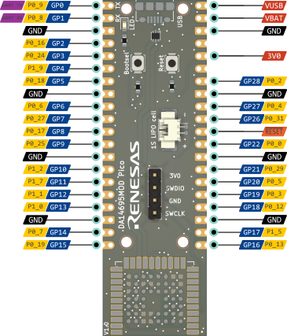

# Renesas DA14695MOD Pico Board

The Renesas DA14695MOD Pico board is a versatile 2-layer development board designed with compatibility and functionality in mind. Designed to be compatible with the Pico pinout, this board offers a range of features including Bluetooth Low Energy (BLE) capabilities, USB connectivity, a battery connector equipped with an on-chip charger, and 4 MB of onboard FLASH storage.

## Features

- **BLE 5.2 Connectivity**: Leverage the power of Bluetooth Low Energy 5.2 with the integrated SmartBond DA14695 SoC.
- **USB Connectivity**: Easily connect and communicate with the board using the USB interface.
- **Battery Charging**: The onboard battery connector, coupled with the on-chip charger, allows for convenient battery management.

## DA14695 Module 

The board is based on the SmartBond DA14695 Bluetooth low energy 5.2 system-on-chip (SoC), making it a comprehensive solution for various applications. The DA14695 Module encompasses all the hardware features and capabilities of the DA14695 SoC, with integrated passives, an antenna, a 32Mbit QSPI FLASH, and user-friendly software support. The module's design focuses on broad market use, offering certifications across regions. This approach translates to reduced development costs, minimized risks, and faster time-to-market.

For detailed technical specifications of the DA14695 Module, refer to the [Renesas website](https://www.renesas.com/us/en/products/wireless-connectivity/bluetooth-low-energy/da14695mod-smartbond-bluetooth-le-52-high-integration-including-usb-charger-module).

## Repository Contents

This GitHub repository houses all the design files for the DA14695MOD Pico board. These files are compatible with KiCAD 6. The full schematic is included as pdf PDF [here](Assets/Pico%20schematic%20final.pdf).

## Board Pinout

To help you get started quickly, here's a visual representation of the board's pinout:

